# 🎓 VeoLMS - Full Stack Learning Management System 


---

# 📖 About
- ✅ Drag & Drop Course Structure
- ✅ Course Editing
- ✅ Public Course Pages
- ✅ Stripe Payments
- ✅ Enrollment System
- ✅ Student Dashboard
- ✅ Progress Tracking
- ✅ Analytics Dashboard
- ✅ Deployment to Vercel


---

# ✨ Features

## 🎨 Frontend

- Next.js 15 (App Router)
- TypeScript
- Tailwind CSS
- Shadcn UI
- Responsive Design
- Beautiful Animations
- Dark Mode Support

---

## 🔐 Authentication

- Better Auth
- Email OTP Login
- GitHub OAuth
- Session Management
- Protected Routes

---

## 🛡 Security

- Arcjet Protection
- Rate Limiting
- Bot Detection
- XSS Protection
- SQL Injection Protection
- Secure API Routes

---

## 👨‍💼 Admin Dashboard

- Create Courses
- Edit Courses
- Delete Courses
- Publish / Unpublish Courses
- Manage Chapters
- Manage Lessons
- Upload Course Videos
- Upload Attachments
- Drag & Drop Course Structure
- Analytics Dashboard

---

## 👨‍🎓 Student Dashboard

- Purchased Courses
- Watch Videos
- Track Progress
- Mark Lessons Complete
- Continue Learning
- Enrollment History

---

## 💳 Stripe Integration

- Secure Checkout
- Course Purchase
- Enrollment Creation
- Stripe Webhooks
- Payment Verification

---

## 📈 Analytics

- Total Revenue
- Student Count
- Course Sales
- Enrollment Statistics
- Progress Analytics

---

## 📂 File Uploads

- Presigned URLs
- AWS S3
- Tigris Storage
- Secure Uploads
- File Deletion

---

## 🚀 Deployment

- Vercel
- Environment Variables
- Production Build
- Middleware Protection

---


# 🖼 FlowChart
## flowchart

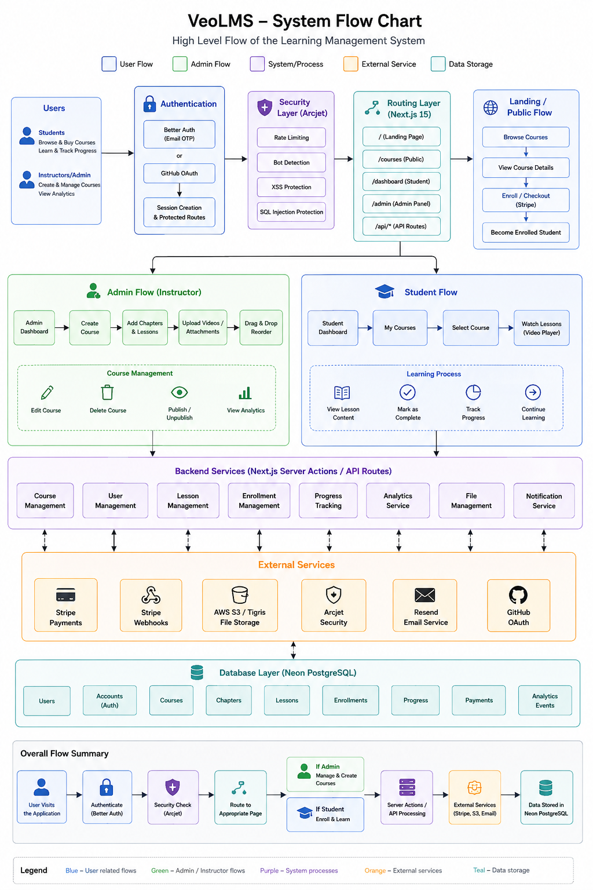


# 🖼 Screenshots

Create a folder named **screenshots** inside your project.

```
screenshots/
│
├── landing-page.png
├── login.png
├── admin-dashboard.png
├── create-course.png
├── edit-course.png
├── drag-drop.png
├── analytics.png
├── checkout.png
├── student-dashboard.png
├── course-player.png
├── progress-tracking.png
└── deployment.png
```

## Landing Page

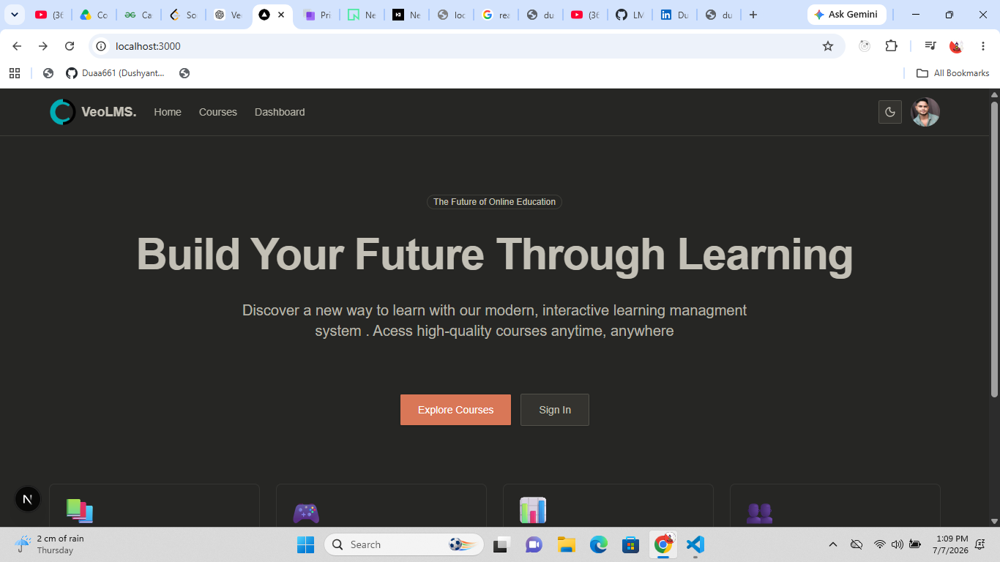

---

## Login

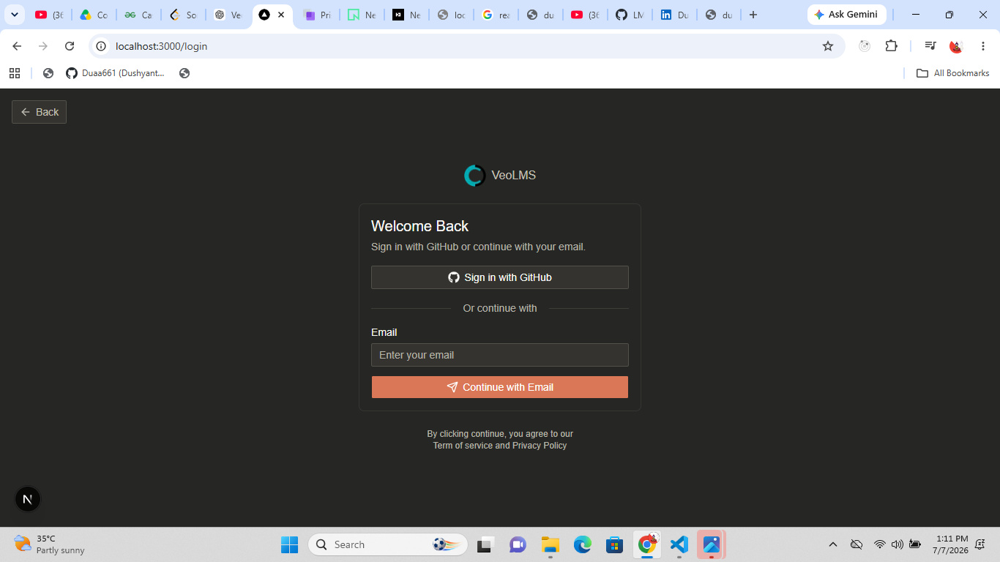

---

## Admin Dashboard

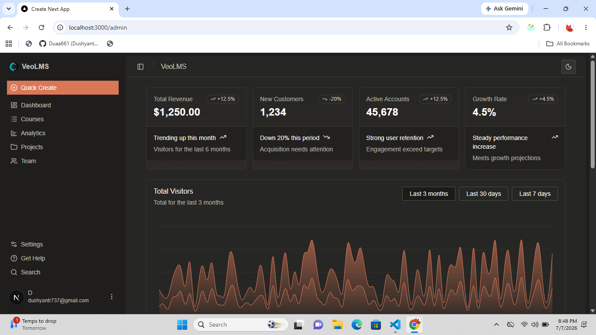

---

## Create Course

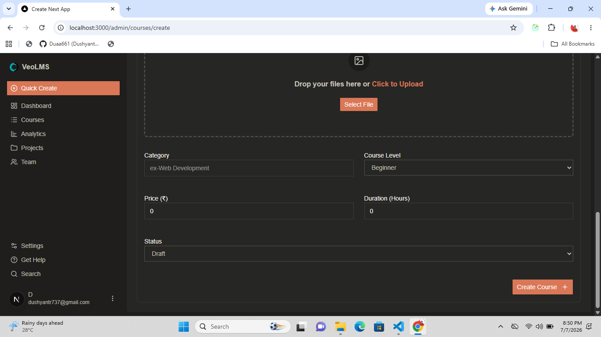

---

## Edit Course

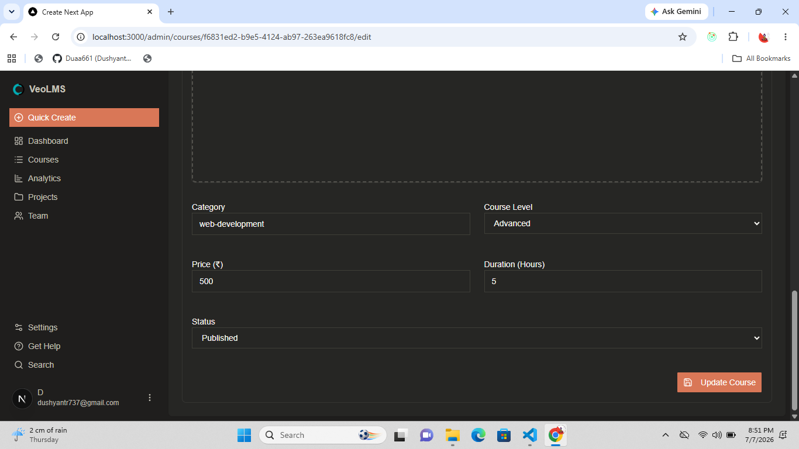

---

## Drag & Drop Builder

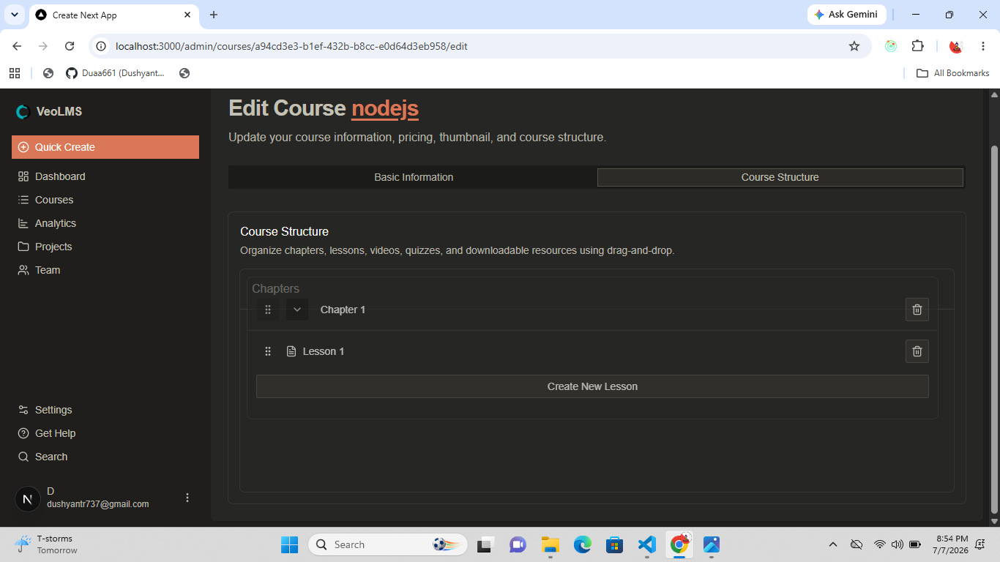

---

## Analytics

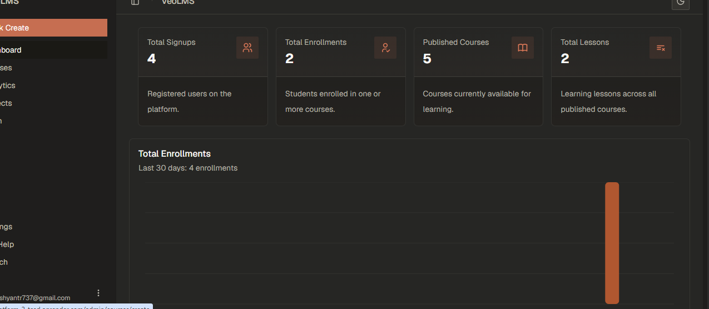

---

## Stripe Checkout

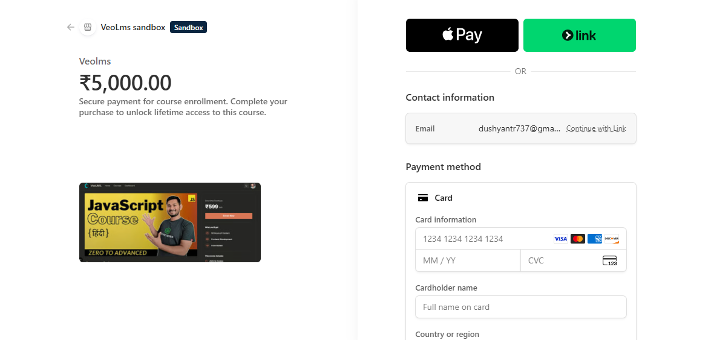

---

## Student Dashboard

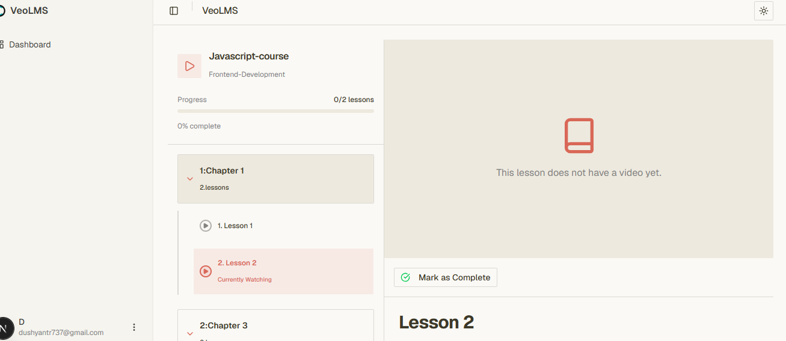

---

## Course Player


---

## Progress Tracking

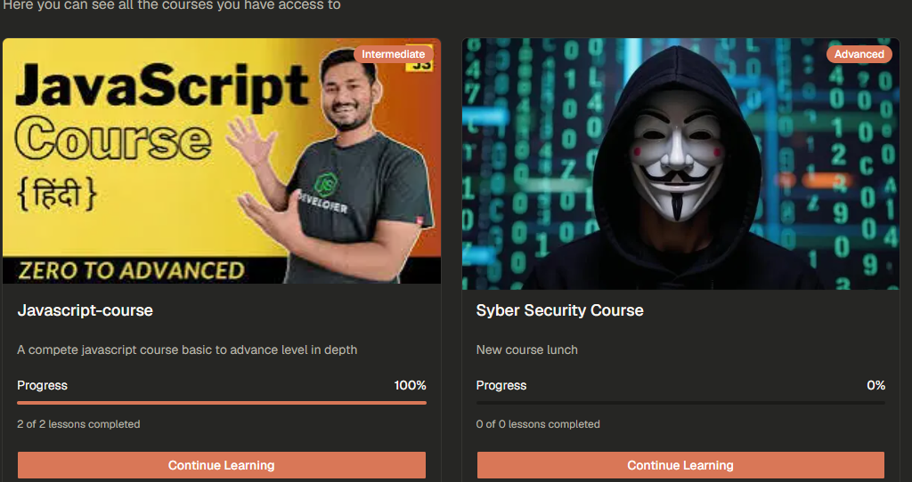

---

# 🛠 Tech Stack

| Category | Technology |
|------------|------------|
| Framework | Next.js 15 |
| Language | TypeScript |
| Styling | Tailwind CSS |
| UI | Shadcn UI |
| ORM | Prisma |
| Database | Neon PostgreSQL |
| Authentication | Better Auth |
| Payments | Stripe |
| Security | Arcjet |
| Validation | Zod |
| Storage | AWS S3 / Tigris |
| Deployment | Vercel |

---

# 📂 Folder Structure

```
app/
components/
actions/
hooks/
lib/
prisma/
public/
screenshots/
types/
README.md
```

---

# ⚙ Installation

## Clone Repository

```bash
git clone https://github.com/yourusername/veolms.git

cd veolms
```

---

## Install Dependencies

```bash
pnpm install
```

---

## Install Shadcn UI

```bash
pnpm dlx shadcn@latest add alert-dialog avatar badge breadcrumb button card chart checkbox collapsible dialog drawer dropdown-menu form input-otp input label progress select separator sheet sidebar skeleton sonner table tabs textarea toggle-group toggle tooltip
```

---

## Environment Variables

Create a `.env` file.

```env
DATABASE_URL=

BETTER_AUTH_SECRET=
BETTER_AUTH_URL=

GITHUB_CLIENT_ID=
GITHUB_CLIENT_SECRET=

RESEND_API_KEY=

ARCJET_KEY=

STRIPE_SECRET_KEY=
STRIPE_WEBHOOK_SECRET=

AWS_ACCESS_KEY_ID=
AWS_SECRET_ACCESS_KEY=
AWS_BUCKET_NAME=
AWS_REGION=

NEXT_PUBLIC_APP_URL=
```

---

## Generate Prisma Client

```bash
pnpm prisma generate
```

---

## Push Database

```bash
pnpm prisma db push
```

---

## Run Development Server

```bash
pnpm dev
```

Visit:

```
http://localhost:3000
```

---

# 📚 Learning Outcomes

By completing this project, you will learn:

- Authentication with Better Auth
- Email OTP Login
- OAuth Authentication
- Server Actions
- Prisma ORM
- PostgreSQL
- Stripe Integration
- Stripe Webhooks
- AWS S3 Uploads
- Drag & Drop using DnD Kit
- Rich Text Editors
- Analytics Dashboard
- Student Progress Tracking
- Middleware Protection
- Secure API Development
- Production Deployment

---


# 📚 Resources

- Next.js
- Tailwind CSS
- Shadcn UI
- Prisma
- Neon Database
- Better Auth
- Arcjet
- Stripe
- Tigris Storage
- Zod
- Vercel

---

# 🚀 Deployment

Deploy the application using **Vercel**.

1. Push code to GitHub
2. Import repository into Vercel
3. Configure environment variables
4. Deploy

---

# 🤝 Contributing

Contributions are welcome!

1. Fork the project
2. Create your feature branch
3. Commit your changes
4. Push your branch
5. Open a Pull Request

---

# 📄 License

This project is licensed under the MIT License.

---

# 👨‍💻 Author

**Dushyant Rajput**

- GitHub: https://github.com/Duaa661
- Portfolio: https://dushyant-chauhan-protfolio.netlify.app/
- LinkedIn: https://www.linkedin.com/in/dushyant-chauhan-9ab359245/

---

## ⭐ Support

If you found this project helpful, consider giving it a ⭐ on GitHub.

It helps others discover the project and motivates future improvements.

---

**Built with ❤️ using Next.js 15, Prisma, Neon PostgreSQL, Better Auth, Stripe, Arcjet, Tailwind CSS, and Shadcn UI.**
